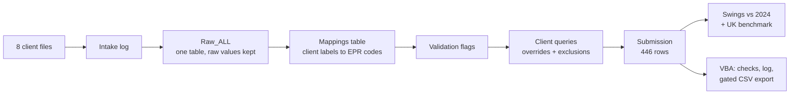
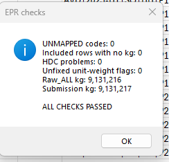
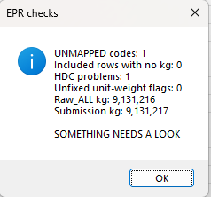
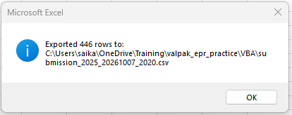

# UK Packaging EPR Data Project (Excel + VBA)

**From eight messy client files to one checked, automated packaging submission.**

A practice project that mirrors the day-to-day work of an **EPR Data Consultant**: collect packaging data from clients, clean and standardise it, validate it, query the problems, build the final submission, explain year-on-year swings, and automate the repetitive parts in VBA.

Built in Excel (with a little Python where Excel struggled) on real UK packaging EPR categories and real national totals.

> **About the data:** the clients, people and figures are a **fictional practice pack**, built on the real UK EPR code lists and the Environment Agency's published national totals (pEPR Reported Packaging Data). The pack includes a hidden answer key, which I only opened at the end to mark my work.

---

## Results

| | |
|---|---|
| Client files | 8, in 8 different formats (xlsx, report layout, ERP CSV, European CSV, JSON in pounds, two files to join) |
| Rows standardised into one table | 11,894 |
| Rows excluded, each with a written reason | 1,013 (old spec versions, Republic of Ireland, stock adjustments, duplicates) |
| Final submission | 446 rows |
| **Match with the answer key** | **100%: every row, weight and unit** |
| Client queries raised | 20 (16 closed, 2 open, 2 parked for swings) |
| Swings flagged and explained | 7, plus 1 just under the threshold |
| **Checks + export** | **about 6 minutes by hand, about 3 seconds with VBA** |

---

## The pipeline

| Module | What I did |
|---|---|
| 1. Intake | Opened every file before touching it and logged what was wrong: missing periods, encodings, units, out-of-scope rows |
| 2. One table | Loaded all 8 clients into `Raw_ALL`, keeping every raw value exactly as sent. Joined CCR's sales to its packaging specs (a left join, so unspecified SKUs stay visible) |
| 3. Mapping | A `Mappings` dictionary (`field\|raw_value` to code) turns "Plastik", "PP plastic", "PL  " and so on into `PL`. Rules handle what a lookup can't (MDC class hidden in its type label, assumed packaging types, CCR shipping cases) |
| 4. Validation | Flags for missing or negative weights, unmapped codes, invalid household drinks containers, duplicates, and a **median** grams-per-unit check that caught 4 tonnes-as-kg errors and one x10 slip |
| 5. Queries | 20 client queries. Corrections go in `override_kg`, exclusions get a written `exclude_reason`. Nothing raw is overwritten or deleted |
| 6. Submission | Built with spilling `UNIQUE` / `TEXTSPLIT` / `SUMIFS` formulas, then marked against the answer key |
| 7. Swings | Client and material totals vs 2024 with a 20% flag, plus a UK benchmark in percentage points |
| 8. VBA | `RunChecks` (5 checks + audit log), `ExportSubmission` (dated CSV, values only), and `CheckAndExport`, a gate that refuses to export if any check fails |

---

## Screenshots

| Checks passing | Same checks after I broke one cell on purpose | Export |
|---|---|---|
|  |  |  |

One bad cell (`AL` changed to `XYZ`) set off **two** alarms (an unmapped code, and an invalid drinks-container material) while the kg totals didn't move. That's why codes are checked separately from totals.

---

## Problems I hit, and how I found them

Building this, I broke things, and finding them is the part I learned most from:

- **Find & Replace wiped every comma from every formula.** Recovered from version history, then moved the comma logic into the weight formula so raw data is never bulk-edited.
- **Filling down with a filter on overwrote 26 SKUs.** Caught because `COUNTIF` of one SKU returned 72 instead of 46. Repaired from the source files and proved clean with counts that must be 0.
- **An off-by-one delete removed 4 real rows while the totals still looked fine.** Found the exact 4 with an anti-join (`COUNTIFS` against the list of expected rows).
- **752 rows suddenly UNMAPPED.** The count matched the new late file exactly; `LEN` and `COUNTIF` showed one period spelling missing from the dictionary.
- **Submission had 440 rows instead of 446, with an identical total weight.** Totals match but counts don't, so it's a labelling problem. Traced to a formula on the MDC rows pointing at row 5 instead of its own row.

All 19 are in [docs/problems-and-fixes.md](docs/problems-and-fixes.md).

---

## What's in this repo

| Path | What it is |
|---|---|
| [`docs/story.md`](docs/story.md) | The full story, module by module: how I thought, every problem and fix |
| [`docs/formulas.md`](docs/formulas.md) | Every formula, what it does and why it's written that way |
| [`docs/vba.md`](docs/vba.md) | The VBA code explained line by line, and how I tested it |
| [`docs/problems-and-fixes.md`](docs/problems-and-fixes.md) | One table of every problem, how I found it, the fix and the lesson |
| [`workbook/master_2025_vba.xlsm`](workbook/) | The working Excel file (macros included) |
| [`vba/EPR_Automation.bas`](vba/EPR_Automation.bas) | The VBA module as plain text |
| [`python/`](python/) | Three small scripts: flatten the GGS JSON, read the European CSV, join CCR sales to specs |
| [`data/`](data/) | The fictional practice pack: client files, reference data, client replies, answer key |
| [`work/`](work/) | Intake log, mapping table, query log |
| [`output/submission_2025.csv`](output/submission_2025.csv) | The final 446-row submission produced by the macro |

**To try it:** open `workbook/master_2025_vba.xlsm` in desktop Excel, enable macros, go to the **Checks** sheet and click **Run EPR checks**, or press **Alt+F8** and run `CheckAndExport`. Change the `OUT_FOLDER` constant in the VBA to a folder on your machine first.

---

## Tools

Excel (XLOOKUP, SUMIFS, COUNTIFS, UNIQUE, FILTER, TEXTSPLIT, dynamic arrays) · VBA · Python (pandas) in Google Colab

## Key habits this project taught me

- Never overwrite raw data: add a clean column next to it.
- Exclude, don't delete: every excluded row keeps a reason.
- Reconcile counts per group, not just the total.
- Never fill down or paste with a filter on.
- A swing flag is a question, not a verdict.
- Test every check in both directions: break something on purpose.
- Automate only what you've already done, and understood, by hand.

---

*Sai Zaw · MSc Data Science (Distinction), UWE Bristol · Built September to October 2026*
